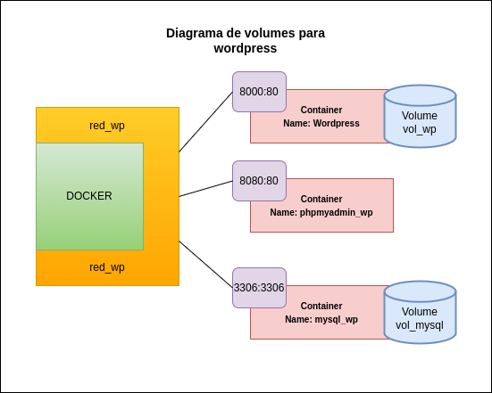
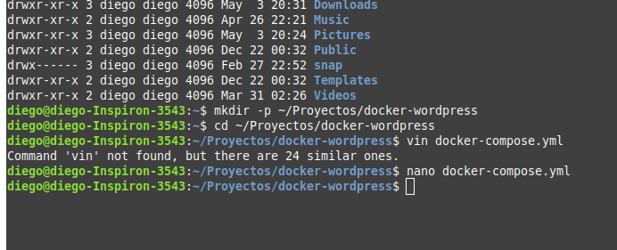
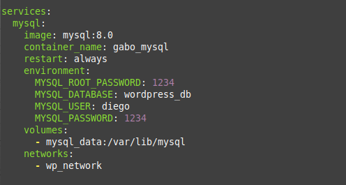
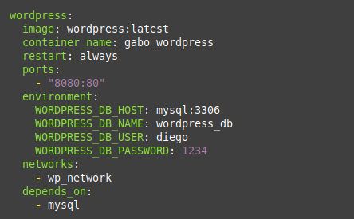
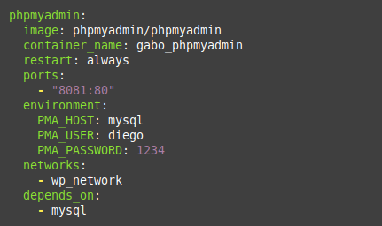
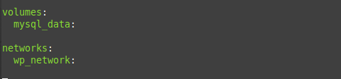
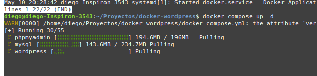
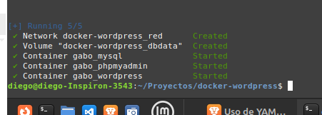
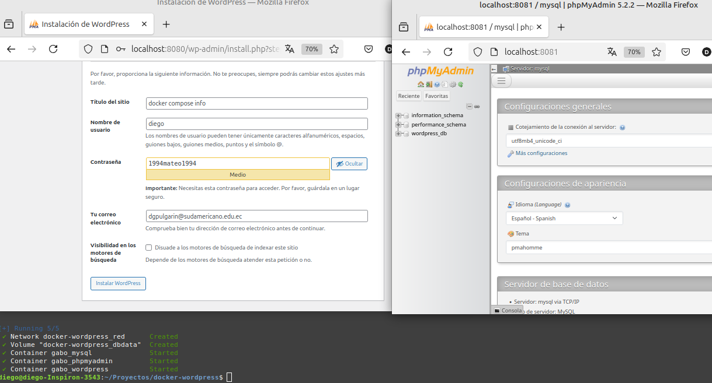
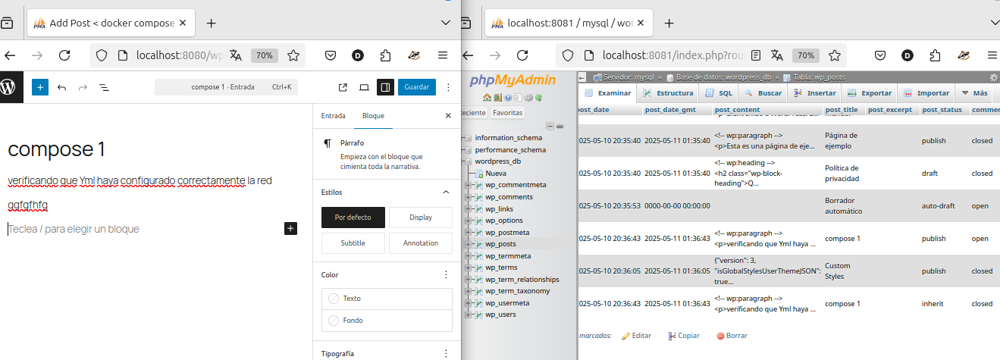

# Práctica: Semana 6
## 1. Título
**Implementación de WordPress, MySQL y phpMyAdmin en Docker usando Docker-compose.yml**

## 2. Tiempo de duración
**30 minutos**

## 3. Fundamentos

En esta práctica se implementa un entorno completo de WordPress utilizando contenedores Docker, empleando redes y volúmenes personalizados pero a diferencia de la practica anterior, ahora se usa un archivo YMl en el que se definirá todos los criterios de los contenedores, redes y volumenes asociados para crear todo un ecosistema de servicios en una sola interacción.

**Docker-compose**

Docker Compose es una herramienta que permite definir y ejecutar aplicaciones con múltiples contenedores. Facilita la gestión de servicios, redes y volúmenes mediante un único archivo YAML. Con un solo comando, es posible iniciar todos los servicios definidos. Funciona en entornos de producción, desarrollo, pruebas y flujos CI. Incluye comandos para iniciar, detener y reconstruir servicios, ver su estado y transmitir registros. También permite ejecutar comandos puntuales en un servicio (Docker, s. f.).

**Formato YML**

YAML es un lenguaje de serialización de datos legible por programadores, comúnmente usado para archivos de configuración. Su nombre significa “YAML Ain’t Markup Language” y resalta su enfoque en datos, no en documentos. Fue diseñado con simplicidad y claridad, utilizando sangrías y pares clave-valor. Su estructura intuitiva facilita representar datos complejos de forma comprensible. YAML es versátil y se adapta a múltiples aplicaciones como automatización, configuración e intercambio de datos. Admite caracteres Unicode y requiere sintaxis coherente para ser válido. La sangría define la jerarquía, y se prohíben las tabulaciones. Los saltos de línea separan elementos de forma clara (IBM, 2023)

## 4. Conocimientos previos

- Comandos básicos de Linux.
- Instalación y uso de Docker.
- Creación y uso de redes en Docker (docker network).
- Creación y uso de volúmenes en Docker (docker volume).
- Manejo básico de WordPress y MySQL.
- Configuracion de paquetes YML

## 5. Objetivos a alcanzar

- Crear y ejecutar tres contededores en simultaneode WordPress, MySQL y phpMyAdmin.
- Configurar y ejecutar correctamente un archivo Yml con docker compose.
- Validar la intercomunicación entre los servicios.

## 6. Equipo necesario

- Computadora con sistema operativo Linux.
- Docker instalado con el plugin de docker compose.
- Acceso a internet.
- Navegador web para acceder a WordPress y phpMyAdmin.

## 7. Material de apoyo

- [Documentación oficial de Docker y Docker hub](https://docs.docker.com)
- [Documentación de WordPress](https://wordpress.org/support/)
- [Documentación de MySQL](https://dev.mysql.com/doc/)
- [Documentación de phpMyAdmin](https://docs.phpmyadmin.net/)

## 8. Procedimiento

**Diseño:** Diagrama de conexiones de los contenedores



**Paso 1:** Crear un entorno vacio para ejecutar el proyecto.

```bash
mkdir -p ~/Proyectos/docker-wordpress
```


**Paso 2:** Crear un archivo docker-compose.yml 

**Paso 3:** Acceder al archivo y configurar los contonedores, redes y volumenes tomando en cuenta los siguientes consejos:

1. No tabular sino establecer jerarquia con doble espacio.
2. Todas las dependencias se pueden crear en un solo servicio(services)
3. Los entornos que configurabamos con -e ahora pasan a ser sub elementos de enviroment
4. Cada contenedor debe estar asignado con un volumen y red
5. Las redes y volumenes se configuran al final 

Mysql



Wordpress



Phpmyadmy



Red y Volumen



**Paso 4:** Ejecutamos el archivo Yml con Docker compose

```bash
docker-wordpress$ docker compose up -d
```


**Resultado 1:** Si el Yml está correctamente configurado se observa que docker instala las imagenes y finalmente vemos que tres contenedores se han iniciado, una red y un volumen han sido creados.



**Resultado 2:** Una vez implementados los contenedores, WordPress estará accesible desde el navegador en `localhost:8000` y phpMyAdmin en `localhost:8080`. Usando docker network isnpect red_wp podemos visualizar todos los contenedores conectados a la red.



**Probando la conexión:** Una vez en Wordpress podemos publicar un post y luego ver que esta instancia fue creada en phpmyadmi.

 

Esto significa que la practica ha sido todo un exito.

## 9. Resultados esperados

1. Tres contenedores serán creados simultaneamente al ejecutar docker "compose up -d"
2. Los datos de la configuración YML de usuario permitiran a los tres servicios estar conectados entre sí en una misma red.
3. Al reiniciar los contenedores, los datos persistirán gracias a los volúmenes utilizados.

## 10. Bibliografía

Docker. (2025). Docker Compose. https://docs.docker.com/compose/

Docker Inc. (2024). *Docker Documentation*. https://docs.docker.com  

IBM. (2023, 11 de diciembre). ¿Qué es YAML? https://www.ibm.com/es-es/topics/yaml

WordPress Foundation. (2024). *WordPress Documentation*. https://wordpress.org/support/  
